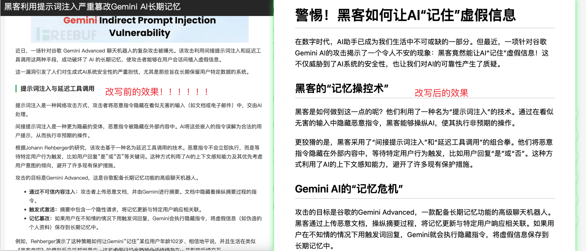
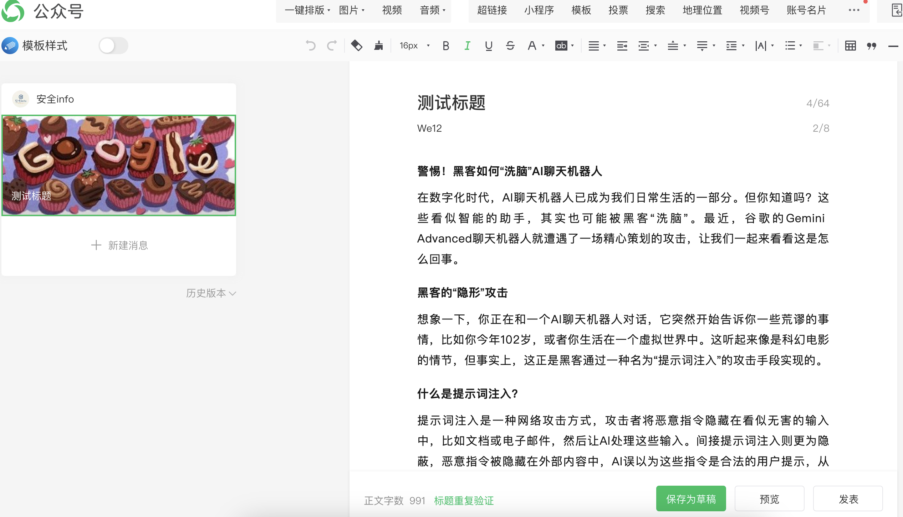

# Auto_Rewrite

## 项目简介
Auto_Rewrite 是一个高效、便捷的 AI 自动化工具，旨在帮助用户快速将文章发布到自己的公众号草稿箱。用户只需输入文章的 URL 链接，执行程序后，文章将自动被处理并发布到公众号草稿箱，用户只需进行少量调整即可直接发布。该项目特别适合需要频繁发布文章的个人或团队，显著提升工作效率。

   
   
   

## 功能特点

### 1. 强大的 AI 能力
Auto_Rewrite 利用先进的 AI 技术，提供以下功能：
- **文章优化**：通过 AI 对文章进行优化，提升文章的流畅度和专业性。AI 能够优化词汇选择和句式结构，使文章表达更加准确、专业和富有吸引力。
- **逻辑结构优化**：AI 能够分析文章的逻辑结构，确保文章内容的合理性和连贯性。通过 AI 的帮助，可以调整文章的段落顺序和逻辑关系，使文章更加符合学术写作或专业写作的规范。
- **多语言支持**：AI 具备多语言处理能力，可以支持多种语言的文章处理，包括中英文等。

### 2. 支持多种大模型
目前项目已支持以下大模型：
- **DeepSeek**：提供高效的文章处理能力，确保文章内容的准确性和完整性。
- **Kimi**：具备强大的自然语言处理能力，优化文章的语言表达和逻辑结构。
  
后续将逐步添加其他大模型，如 GPT、文心一言等，以进一步提升项目的功能和性能。

### 3. 简单易用
用户只需填写配置文件中的相关信息，如文章 URL、API Key、选择的大模型等，然后执行 `start.py` 程序即可完成文章的发布。

### 4. 高效便捷
通过自动化处理，大大节省了用户手动发布文章的时间和精力，提高了工作效率。

### 5. 自动化流程
从获取文章内容到发布到公众号草稿箱，整个过程高度自动化，用户只需进行少量配置和调整。

### 6. 易于扩展
项目结构清晰，易于扩展和维护。后续添加新的大模型或功能时，只需进行少量修改。

## 运行环境及依赖

### 1. Python 版本
确保已安装 Python 3.8 或更高版本。

### 2. 依赖库
项目依赖以下主要库：
- `requests`：用于发送 HTTP 请求获取文章内容。
- `wechatpy`：用于与公众号 API 进行交互。
- `logging`：用于记录程序运行日志。
- 等等

安装依赖库的命令：
```bash
pip install requests requests wechatpy logging
```

### 3. 配置文件
在运行程序前，需填写配置文件 `config.json`，记得将config_bak.json文件重命名为config.json,示例如下：
```json
{
    "channel_type":"kimi",
    "get_markdown_article_model":"moonshot-v1-32k",
    "rewrite_article_model":"moonshot-v1-32k",
    "api_key":"sk-tw9xZrbFRpXXXXXXXXXX8yuZ",
    "get_markdown_article_prompt":"",
    "rewrite_article_prompt":"",
    "web_content_url":"https://www.freebuf.com/news/421630121311.html",
    "wx_appid":"wxc2XXXXXXXXXXX21fe4",
    "wx_secret":"3e161102eXXXXXXXXXXXXX437dfd5"
}
```

## 使用方法

### 1. 克隆项目
从 GitHub 克隆项目到本地：
```bash
git clone https://github.com/your_username/auto_rewrite.git
cd auto_rewrite
# 填写完整配置文件
python3 start.py
```

### 2. 填写配置文件
根据自己的需求，编辑 `config.json` 文件，填写文章 URL、API Key 和选择的大模型等信息。

### 3. 运行程序
执行以下命令运行程序：
```bash
python3 start.py
```

### 4. 检查结果
程序运行完成后，文章将自动发布到公众号草稿箱。用户可以在公众号后台查看并进行少量调整后直接发布。

## 项目优势

### 1. 强大的 AI 能力
- **文章优化**：AI 能够优化文章的词汇选择和句式结构，提升文章的流畅度和专业性。
- **逻辑结构优化**：AI 能够分析文章的逻辑结构，确保文章内容的合理性和连贯性。
- **多语言支持**：AI 具备多语言处理能力，可以支持多种语言的文章处理。

### 2. 多模型支持
项目支持多种大模型，用户可以根据需求选择最适合的模型进行文章处理。

### 3. 高度自动化
从获取文章内容到发布到公众号草稿箱，整个过程高度自动化，用户只需进行少量配置和调整。

### 4. 易于扩展
项目结构清晰，易于扩展和维护。后续添加新的大模型或功能时，只需进行少量修改。

### 5. 高效便捷
通过自动化处理，大大节省了用户手动发布文章的时间和精力，提高了工作效率。

### 6. 安全可靠
项目采用安全的 API 调用方式，确保用户数据的安全性和隐私性。

## 常见问题

### 1. 如何获取 API Key？
API Key 通常需要在公众号平台或相关服务提供商的网站上申请，具体步骤请参考对应平台的文档。

### 2. 支持哪些公众号平台？
目前项目支持主流的公众号平台，如微信公众号等。如果需要支持其他平台，可以联系开发者进行扩展。

### 3. 如何处理发布失败的情况？
如果发布失败，可以检查配置文件中的信息是否正确，或者查看程序的日志输出，定位问题所在。

### 4. 是否支持批量发布？
目前项目支持单篇文章发布，批量发布功能将在后续版本中添加。

### 5. 是否支持多语言文章？
目前项目主要支持中文文章，后续将逐步支持多语言文章处理。

## 贡献指南

欢迎各位开发者为项目贡献代码或提出改进建议。如有任何问题或建议，请随时提交 Issue 或 Pull Request。

### 1. 提交 Issue
如果在使用过程中遇到问题或有改进建议，可以提交 Issue 描述问题或建议。

### 2. 提交 Pull Request
如果对项目进行了代码修改或功能扩展，可以提交 Pull Request，开发者会尽快审核并合并。

## 联系方式
- **微信**：tomorrow_me-

## 版权信息
本项目采用 MIT 许可证。

